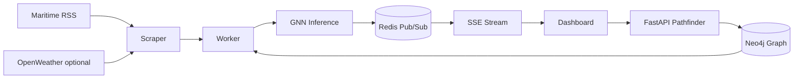

# Logi-Resilience

Predictive maritime logistics platform that models global shipping as a **directed graph** \(G = (V, E)\), ingests high-velocity environmental and news signals, runs a **physics-informed spatio-temporal GNN** for lane risk, and exposes a real-time **Resilience Index** dashboard with Dijkstra-based alternative routing (resilience, sustainability, and essential-goods modes).

## Architecture

| Pillar | Stack |
|--------|--------|
| Graph & DBMS | Neo4j (ports, shipping lanes), Redis (cache + SSE pub/sub) |
| Ingestion | Maritime RSS (NLP keywords), optional OpenWeatherMap |
| Intelligence | PyTorch `SpatioTemporalGNN` + physics loss (`compute_physics_loss`) |
| API | FastAPI, rate-limited pathfinder, SSE `/api/v1/stream` |
| Streaming | Background worker → Redis; optional Kafka (`--profile kafka`) |
| UI | React + Vite, MapLibre GL, Chart.js |
| Gateway | Nginx (HMR frontend, API proxy, unbuffered SSE) |
| Cloud (IaC) | Terraform sketch (`infrastructure/main.tf`) for ECS / secrets |



## Quick start

```bash
cp .env.example .env
docker compose up --build
```

Open **http://localhost** (nginx gateway). Neo4j Browser: **http://localhost:7474** (user `neo4j`, password from compose).

On first boot, the API and worker **auto-seed** 10 major ports and 14 strategic lanes.

### Train GNN checkpoint (optional)

```bash
cd backend
pip install -r requirements.txt
python scripts/train_gnn.py
```

Produces `model_physics.pt` used by API and worker.

### Enable Kafka

```bash
docker compose --profile kafka up --build
```

Set `KAFKA_ENABLED=true` on `worker` and `backend` in `docker-compose.yml`.

## API reference

| Method | Path | Description |
|--------|------|-------------|
| GET | `/health` | Liveness + Neo4j status |
| GET | `/api/v1/graph/ports` | Port catalog |
| GET | `/api/v1/graph/snapshot` | One-shot GNN metrics |
| GET | `/api/v1/stream` | SSE live telemetry |
| POST | `/api/v1/pathfinder/simulate` | Dijkstra routing |

**Pathfinder body:**

```json
{
  "source_id": "SGSIN",
  "target_id": "NLRTM",
  "avoid_edge_id": "lane_sgsin_cnsha",
  "optimization_mode": "resilience"
}
```

`optimization_mode`: `resilience` | `sustainability` | `essential` (humanitarian priority weighting).

## Project layout

```
backend/app/
  api/routes/     # health, graph, pathfinder, stream
  core/           # config, security, rate limiter
  db/             # Neo4j driver, seed data
  models/         # SpatioTemporalGNN
  services/       # analytics, scraper, pathfinder, xai, trainer
  main.py         # FastAPI app
  worker.py       # Telemetry publisher
frontend/src/     # Map, risk panel, route simulator
infrastructure/   # Terraform (AWS ECS / secrets)
```

## MCA / research differentiators

- **Physics-informed loss** on weather and port congestion constraints
- **XAI attribution** (environmental / operational / geopolitical %)
- **Resilience Index** 0–100 (inverse risk) for NGO-friendly UX
- **Sustainability vs resilience** routing toggle
- **Essential-goods mode** weighting cold-chain / humanitarian lanes

## Production checklist

- [ ] Rotate `NEO4J_PASSWORD`, `SECRET_KEY`; use AWS Secrets Manager (see Terraform)
- [ ] Set real `WEATHER_API_KEY` / news provider keys
- [ ] Build frontend with `npm run build` and serve static assets from nginx
- [ ] Disable `--reload` on uvicorn; pin image tags (not `latest` for Kafka/ZK)
- [ ] Add observability (Prometheus, structured JSON logs)
- [ ] Schedule `scripts/train_gnn.py` on historical snapshots in S3

## License

Academic / portfolio use — configure API keys and secrets before any public deployment.
